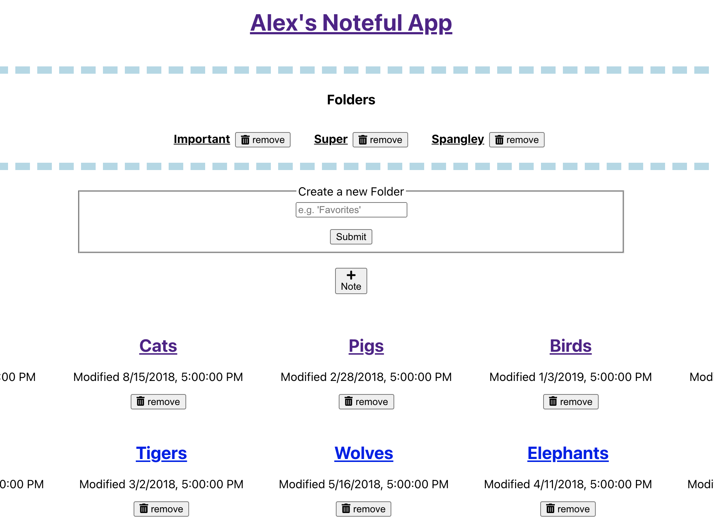
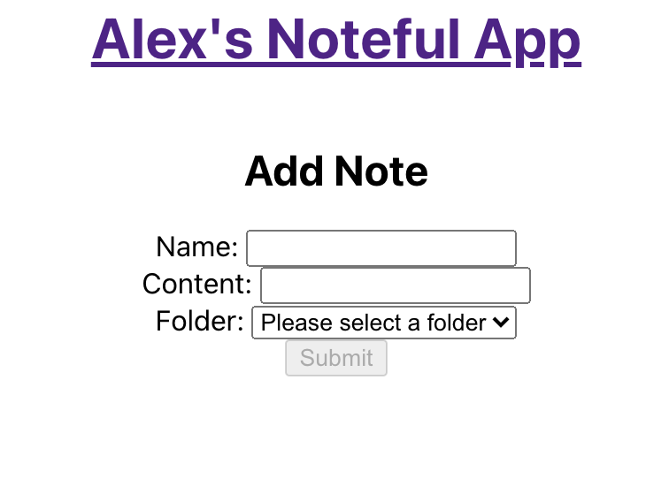

# Noteful: A place to store and organize notes and folders

This project was bootstrapped with [Create React App](https://github.com/facebook/create-react-app).

## Screenshots

Home page: Displays all available folders and notes, along with the options to add a note and/or folder

Add Note: This is the interface to add a note. It is required to include a name, content, and select a folder where the note should live.

### Built With:

React:
- create-react-app
- React Router
- Context
- Boudary Errors

API:
- locally hosted server to fetch and store new data

